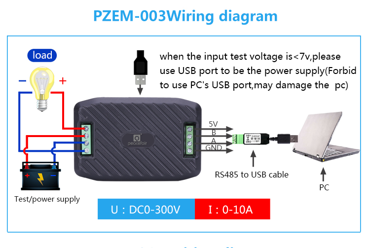

# Read data via RS-458 modbus from pzem-003 module

## Module datasheet:

https://solar-thailand.com/pdf/PZEM-003-Manual.pdf

https://de.aliexpress.com/item/32912901621.html

## Wiring:



## Modbus addresses

| RegAddr | Description | Resolution  |
|---------|---------------------------|------------------------------------|
| 0x0000  | Voltage value             | 1LSB correspond to 0.1V             |
| 0x0001  | Current value             | 1LSB correspond to 0.1A             |
| 0x0002  | Power value low 16 bits   | 1LSB correspond to 0.1W             |
| 0x0003  | Power value high 16 bits  |                                     |
| 0x0004  | Energy value low 16 bits  | 1LSB correspond to 1Wh              |
| 0x0005  | Energy value high 16 bits |                                     |
| 0x0006  | High voltage alarm status | 0xFFFF is alarm 0x0000 is not alarm |
| 0x0007  | Low voltage alarm status  | 0xFFFF is alarm 0x0000 is not alarm |


## Install requirements with:

```pip install -r requirements.txt```


## Run with:

```
    python modbus-pzem-003.py 
    Voltage: 8.88 V
    Current: 0.77 A
    Power: 0.68 W
    Energy: 0.02 WH
```

- if you get a "serial.Serial" Argument error, please uninstall "serial" and "pyserial" with pip uninstall... , then run ```pip install -r requirements.txt``` again
- if you are running under Windows, please replace the 
```instrument = minimalmodbus.Instrument('/dev/tty.usbserial-120', SALVE_ADDRESS)```
with
```instrument = minimalmodbus.Instrument('COMx', SALVE_ADDRESS)```
replacing x with the COM-Port number
